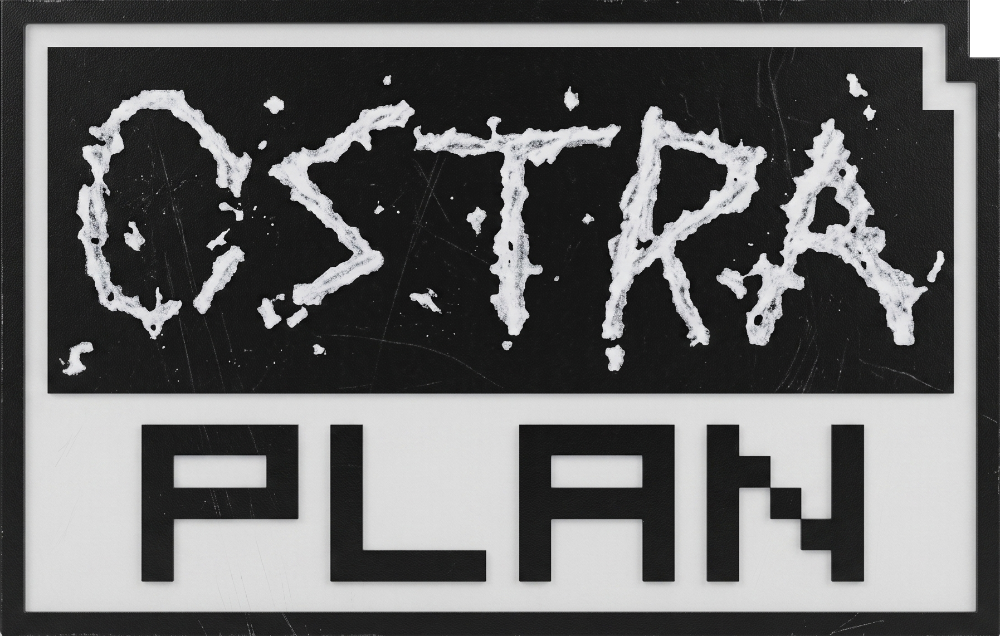

<p align="center"></p>

## What is Ostraplan?

**Ostraplan** is an out-of-game ship planner for **Ostranauts** (Blue Bottle Games).

It lets you drag every buildable part (incl. loaded mods) onto the game's exact tile grid, validated live with the game's *own* rules, so you know a design works before you lay a tile in-game.

> **The Goal:** if you can build it in Ostraplan, you can build it in Ostranauts,
> and it will be a valid ship.

This was achieved by porting the game's validation logic as best I can.
That includes, placement rules, sockets, airtightness, room certification, and the Ship Rating.

**Ostraplan** is a sibling tool to [**Ostrasort**](https://github.com/Valtora/Ostrasort) and I encourage you to use both. **Ostrasort** lets you register your modded ships as a valid mod as well generally managing mod conflicts and loading order.


## Licence & Disclaimer(s)

Ostraplan is a fan-made tool, **not affiliated with or endorsed by Blue Bottle Games**. Ostranauts and all its data and art are © Blue Bottle Games.

Ostraplan ships **none** of it, reading everything from your own install at runtime.

Please support and buy the game: <https://store.steampowered.com/app/1022980/Ostranauts/>.

**You will not be able to use Ostraplan without a valid copy of the game on your machine.**

## No Warranty

I provide Ostraplan as-is, with no warranty of any kind. It can
write to your save files, so back them up first. Use it at your own risk. I am
not responsible if it breaks your game/save or causes your ship to become sentient.

## Active Development

There will 100% be bugs and I will do my best to fix them in a timely
manner but this is a free opensource tool so please be patient and bear with me, I also have a day job!

Please report your bugs here on the repo's Issues tracker.

## Features

### Design

- **Every buildable part in one palette** — the game's eight tabs
  (HULL · HVAC · POWR · SENS · CTRL · FURN · APPS · MISC), searchable, drawn with
  the real 16 px sprites.
- **Build on the real grid** — drag-and-drop with game-accurate autotiling, `R`
  to rotate, crisp pixel-art zoom/pan, and plan-view rotation.
- **A full editing suite** — drag-paint, box/hollow fill, symmetry mirror,
  flood-select, "Replace with…", ship-wide re-skin, group rotate, group flip
  (`H` / `Shift+H`), copy/paste, and unbounded undo/redo.
- **Bill of materials** — install-kit counts for the whole ship or a selection.
- **Zones** — draw and manage the game's crew/trade zones (Haul, Barter, Forbid,
  and content trigger zones): paint them with the same tools as parts, and they
  round-trip faithfully through export and save write-back instead of being dropped
  or shifted onto the wrong tiles.

### Validate

- **Live Validation** — you can't place what the game would refuse; the ghost glows
  green/red with the failing tiles and the reason, and building past an airlock's
  mating face is blocked.
- **Rooms, airtightness & Ship Rating** — flood-fill compartments, room
  certification, and the six-slot rating.
- **Law report** — every problem in one place, tracing air leaks to the exact
  unsealed tile.

### Import & export

- **Import a template** — any core or modded ship.
- **Import your ship from a save** — pull your live layout out of a save game.
- **Edit your live ship** — import it, redesign, and write it back into a **copy**
  of the save, with crew, cargo, position and identity preserved (the original
  untouched).
- **Export as a mod** — a spawnable local mod in the game's own `data/ships`
  shape, rooms and rating precomputed.
- **Wear slider** — export or inject a ship worn rather than pristine, using the
  game's own kiosk damage model (default ~88% condition, no part below 10%).

### Mod-aware

Resolves your `loading_order.json` exactly like the game, so modded parts appear
in the palette. A design records the mods it needs; open it without them and it
stays **read-only** until you enable them, so nothing is silently lost.

*Plus PNG snapshots, light/dark theming, and an optional update check.*

## What Ostraplan won't do

Ostraplan validates the **build** it's a **plan**ner, not a simulator. It won't:

- Simulate power, gas, thermal, or crew pathing (the game authors no per-device
  rates, so an honest budget would need a full network sim);
- Model economy beyond the bill of materials;
- Edit more than one ship per document;
- Write `loading_order.json` (registration stays with Ostrasort), or
  publish to the Workshop (export makes a local mod, you upload in-game);
- (Ostrasort will not) run anywhere but on Windows.

**Read-only first:** it never touches your game install, saves, or
`loading_order.json` by default.

Save-editing features want to create a **copy** by default unless **you opt into** an in-place edit, which then creates a backup anyway (because I care about you).

## Quick start

Download the latest `Ostraplan-vX.Y.Z.exe` from the [Releases](https://github.com/Valtora/Ostraplan/releases) page and double-click it. It's a self-contained executable and if you don't trust me you can build it yourself by following the instructions below.

**Requirements:** Windows, and a **local Ostranauts install**. Ostraplan finds
the game automatically if its installed and reads its data and sprites at runtime. Without this, Ostraplan just doesn't work.

**No game assets are distributed with the tool.**

## Building from source

Needs the .NET 10 SDK.

```powershell
dotnet run --project src\Ostraplan.App     # launch
.\test.ps1                                 # run the test suite (most tests are game-free)
.\test.ps1 -Filter Rooms                   # run a subset by name
.\publish.ps1                              # build publish\Ostraplan.exe (self-contained)
```

Most tests run without the game; the ones that need a local Ostranauts install report as
**skipped** (never a false pass) when it's absent. See [docs/TESTING.md](docs/TESTING.md).

## Documentation

- [docs/usage.md](docs/usage.md) — how to use it, start to finish.
- [CHANGELOG.md](CHANGELOG.md) — what shipped, version by version.
- [docs/SPEC.md](docs/SPEC.md) — design, scope, the `.oplan` format, and the roadmap.
- [docs/GAME-INTERNALS.md](docs/GAME-INTERNALS.md) — the reverse-engineering
  reference: what's ported, deferred, and excluded.
- [docs/TESTING.md](docs/TESTING.md) — how the test suite is structured (game-free vs
  game-gated), how to run it, and how to add a test.
