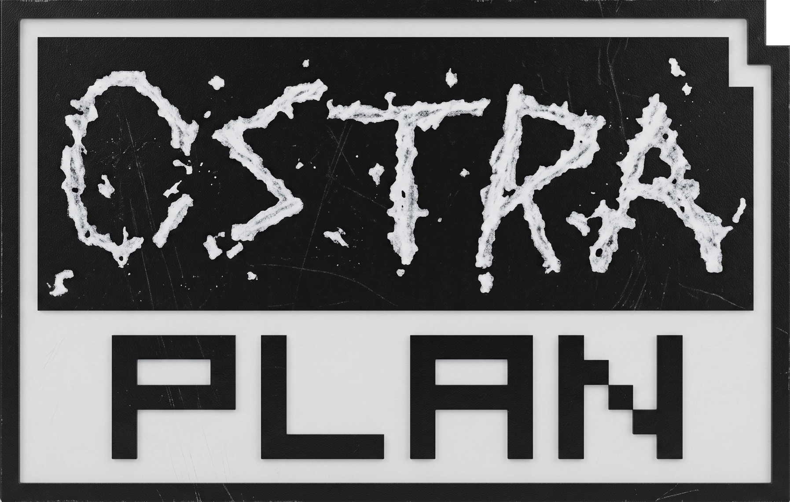

# Ostraplan

**Ostraplan** is an out-of-game ship planner for **Ostranauts** (Blue Bottle Games). Drag every buildable part onto the game's exact tile grid, validated live against the game's *own* rules, and know a design works before you lay a single tile in-game.

> **The Law:** if you can build it in Ostraplan, you can build it in Ostranauts, and it will be a valid ship.

That promise is kept by *porting* the game's real validation logic, decompiled from `Assembly-CSharp.dll`: placement sockets, airtightness, room certification, and the Ship Rating. Ostraplan reads every part, sprite, and mod from your own install at runtime, so it always reflects the game you actually have. It designs ships and gets them into your game, and that is the whole remit: read **[docs/SCOPE.md](docs/SCOPE.md)** before filing a feature request.

It is a sibling tool to [**Ostrasort**](https://github.com/Valtora/Ostrasort), the load-order and mod-conflict manager. Use both: design a ship here, then let Ostrasort register your exported ship mod and keep your load order clean.

## Getting it

Download **`Ostraplan-win-Setup.exe`** from the [Releases](https://github.com/Valtora/Ostraplan/releases) page and run it, or take the portable zip beside it. Updates are automatic. See [docs/usage.md](docs/usage.md#getting-started) for the detail, and [docs/DEVELOPMENT.md](docs/DEVELOPMENT.md) to build it yourself.

**Requirements:** Windows, and a **local Ostranauts install**, which Ostraplan reads its data and sprites from at runtime. Without the game it has nothing to read and won't work. **No game assets are distributed with the tool.**

## Documentation

- [docs/FEATURES.md](docs/FEATURES.md): what it does, on one page.
- [docs/usage.md](docs/usage.md): how to use it, start to finish.
- [docs/SCOPE.md](docs/SCOPE.md): what Ostraplan is for, and where the line is drawn.
- [docs/GAME-INTERNALS.md](docs/GAME-INTERNALS.md): the reverse-engineering reference. How Ostranauts works internally, and what Ostraplan ports.
- [docs/OPLAN-FORMAT.md](docs/OPLAN-FORMAT.md): the `.oplan` document format, field by field.
- [docs/DEVELOPMENT.md](docs/DEVELOPMENT.md): building, running, versioning, and cutting a release.
- [docs/TESTING.md](docs/TESTING.md): how the test suite is structured (game-free vs game-gated) and how to run it.
- [docs/CONVENTIONS.md](docs/CONVENTIONS.md): the conventions a change has to follow.
- [CHANGELOG.md](CHANGELOG.md): what shipped, version by version.
- [CONTRIBUTING.md](CONTRIBUTING.md): bug reports and pull requests.
- [SECURITY.md](SECURITY.md): reporting a security issue.
- [CODE_OF_CONDUCT.md](CODE_OF_CONDUCT.md): how we behave here.

## Licence and disclaimers

Ostraplan is free and open source under the [MIT License](LICENSE). It is a fan-made tool, **not affiliated with or endorsed by Blue Bottle Games**. Ostranauts and all its data and art are © Blue Bottle Games, and Ostraplan ships **none** of it, reading everything from your own install at runtime. Please support and buy the game: <https://store.steampowered.com/app/1022980/Ostranauts/>.

**No warranty.** Ostraplan is provided as-is. It can write to your save files, so back them up first, and use it at your own risk.
